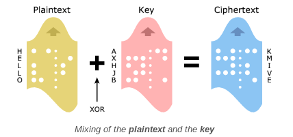

Assignment #4, CSC151.

**One Time Pad Cipher and Unit Test Program**

***What is a One Time Pad Cipher?***

The one-time pad is an encryption technique that cannot be cracked, but requires the use of a single-use pre-shared key that is no smaller than the message being sent. The key is exactly same as the length of message which is encrypted and made up of random symbols. For this project, the random symbols were limited to random uppercase letters generated by one of the functions written. 

***What does this program do?***

This program has in total seven main functions that accomplish the purpose of a one time pad cipher. These are listed below with an explanation of what it does specifically.

shiftLetter(): A function that perfoms math operations: addition, substraction, and modulo in order to shift the letters using the ASCII system. This will transform the letters from the original message into an encrypted one. The math operations perfomed are based on a range that represents the 26 letters of the abecedary in ASCII code which has specific notations for uppercase and lowercase letters. This program also shifts letters from lowercase to uppercase and viceversa. The final output that should be expected for this function to generate is the shifted letter by the number assigned to the key, which is the number of times the letter will shift in order to successfully encrypt the message to an unknown letter. 

encrypts():This function takes as arguments both the message given by the user and the pad generated randomly by the same program. It iterates over the message given and takes the length of it to later assign each character found in the message with a letter from the random pad generate, not accounting for blank spaces or punctuations signs. Once this is done, it shifts the letters using the previous function shiftLetter() and thus adds the new encrypted letter character to an empty list. 

decrypts(): This function does the opposite of the encrypts() function. The difference in the program is that it iterates through the message backwards. It reverses the method of the encypts functin by adding a negative sign to the range specified for characters in the ASCII code system. 

randomUpper(): A function that utilizes the function random() which generates a random number from 0.1 to 1 and then multiplies it by 26 which is the total numbers of in the alphabet and adds 65 which can be read as "A" in uppercase in the ASCII code system. 

generatePad(): Takes the length of the message given and comes up with a random letter for each letter found in the message. Then it adds this letter to an empty list and therefore generates the random path for each message.  

generatePadfile(): Opens the file the user inputs and reads it. 

encipher(): Takes both the random pad and the message and encrypts it using both elements.

decipher(): Takes both the random pad and the encrypted message and uses both of them to decipher it. 

***How to use it?***

This function was built to read only files (.txt). The user can write the name of the file in which their either encrypted or decrypted message is to both encipher and decipher it. The program will open the file, read it, apply the function that is wanted from the user which should also be specified and output the desired encrypted or decrypted message using a one time pad cipher. 
 
***Credits and citations:***

-https://www.geeksforgeeks.org/with-statement-in-python/

-https://www.journaldev.com/22767/python-ord-chr

-https://www.learnpythonwithrune.org/understand-the-security-of-one-time-pad-and-how-to-implement-it-in-python/

-Code previously shown by Professor Brewer on caesar cipher.

-TAs: Waka, Yanning, Allison.

**Unit Test Program**
This unit test suite can be used to preliminarily check if the main functions that the program contains work correctly.
 
